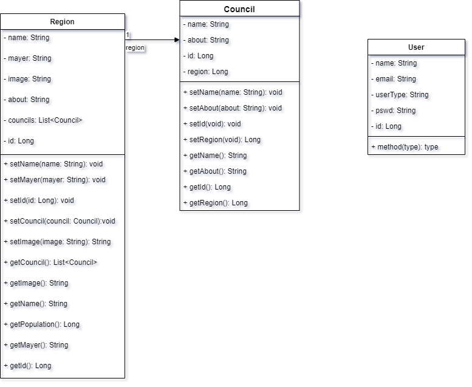
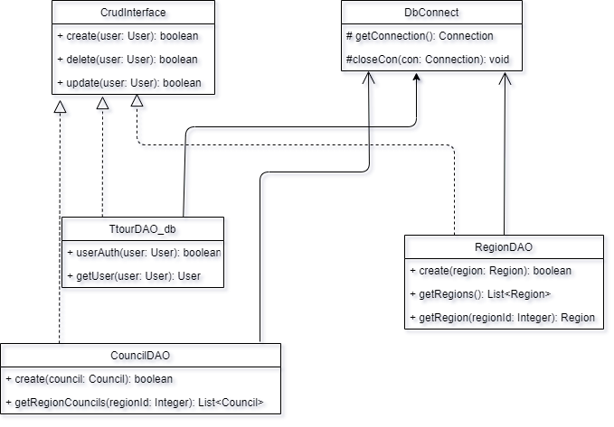
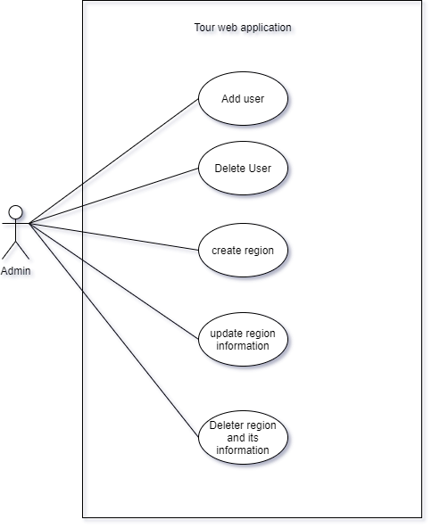
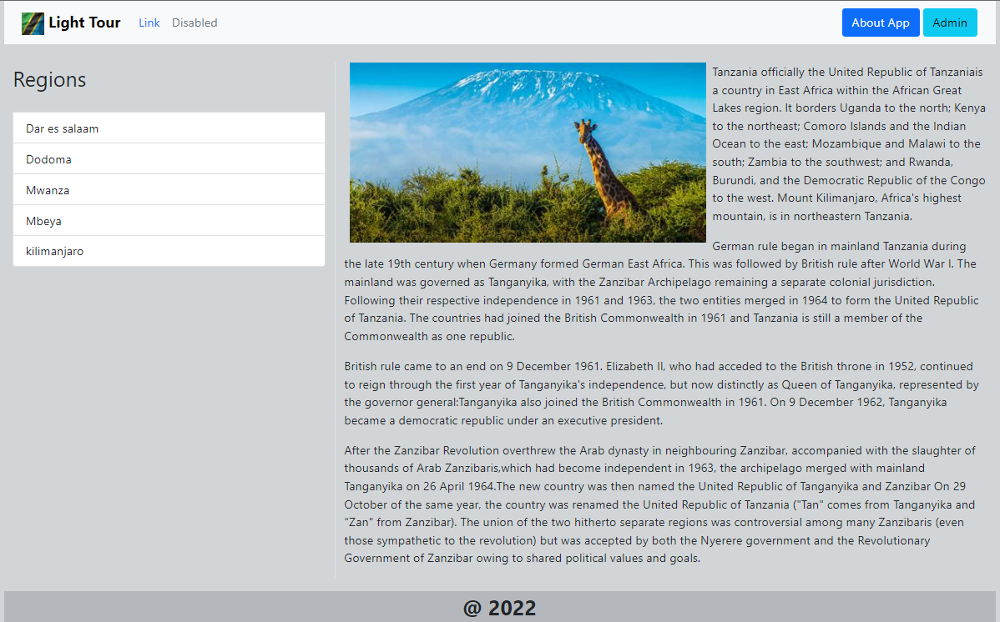
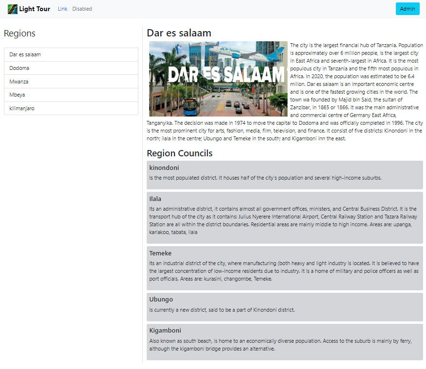
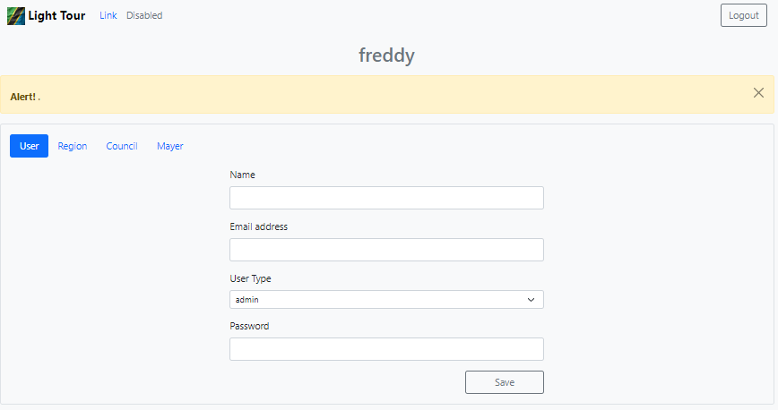

# TourCountryApp
&nbsp;&nbsp;&nbsp;&nbsp;It is a light web application that gives simple, and critical details about some common regions of `Tanzania`; such as current population, description on specific region. 🚨🚨🚨 if you find some of the above not implemented then.... stretch your hands 😎  
Style used is `Object Oriented Programming`, so for the purpose of learning enjoy your tour on the code files  
&nbsp;&nbsp;&nbsp;&nbsp;Two users’ guest and admin are involved. The guest will navigate to read information on different parts of the web site, while the admin is responsible to for adding users (admin) and information to the web. 
> Used tools and `Tech`
* Tomcat server
* jsp syntax *this enables integrating java with html*
* sqlite 
## UML
* Relationship between Classes  

* Class object oriented relations  

## Use case
* admin usecase  

## Home Page

## Sample of a selected region

## Admin home page

